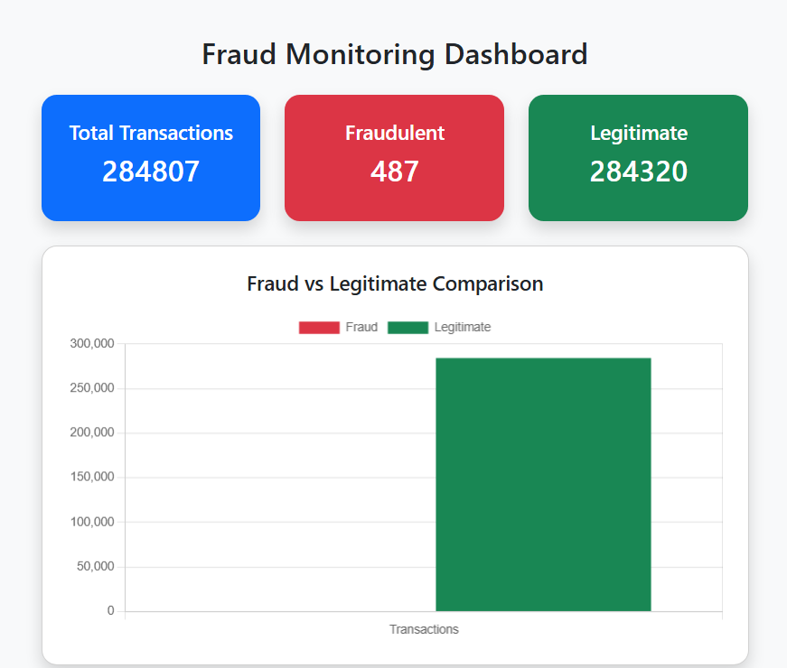
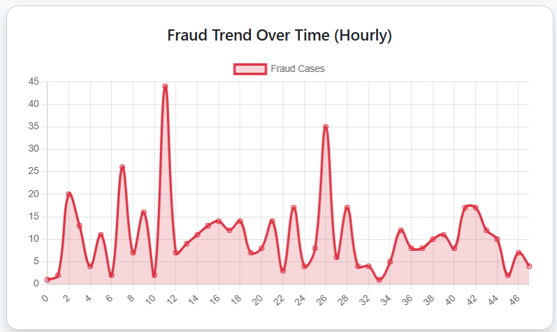
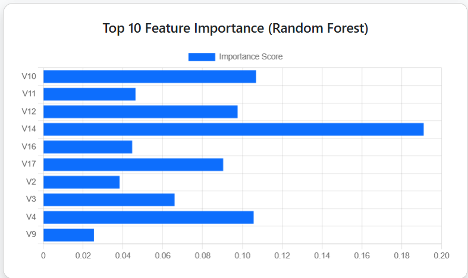
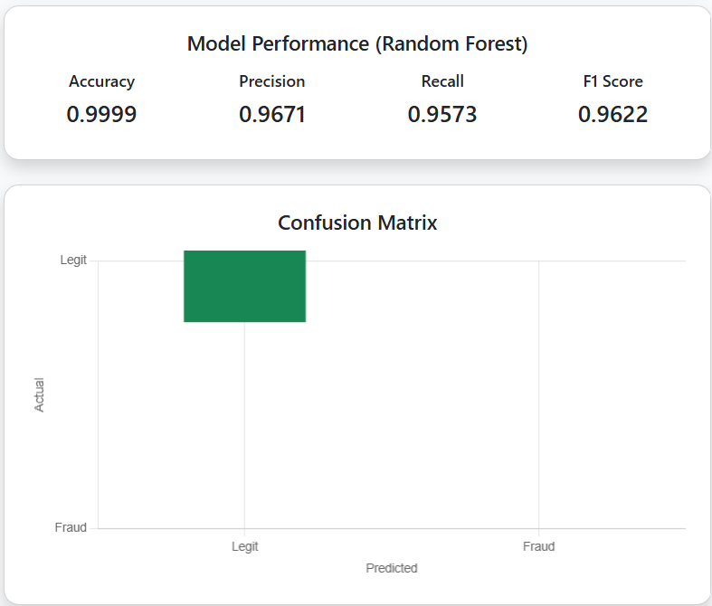
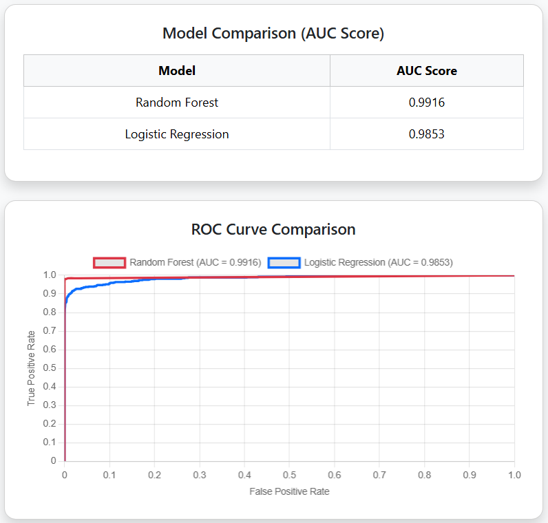

# 🛡️ AI-Powered Credit Card Fraud Detection Dashboard

An end-to-end Machine Learning application for detecting potentially fraudulent credit card transactions using **Random Forest** and **Logistic Regression**, with a **FastAPI-powered web dashboard** for prediction and model analysis.

---

## 📸 Dashboard Preview

### 📊 Dashboard Overview

The dashboard provides an overview of the uploaded transaction dataset, including total transactions, fraudulent transactions, legitimate transactions, and fraud distribution.



---

### 📈 Fraud Trend Analysis

The dashboard visualizes the number of fraudulent transactions across different hours.



---

### 🧠 Feature Importance

The top 10 features contributing to the Random Forest model's predictions are displayed using feature importance scores.



---

### 🎯 Model Performance & Confusion Matrix

The dashboard displays the Random Forest model's Accuracy, Precision, Recall, F1 Score, and Confusion Matrix.



---

### 🤖 Model Comparison & ROC Curve

Random Forest and Logistic Regression are compared using ROC-AUC scores and ROC curves.



---

## 🚀 Features

- 📂 CSV-based batch fraud prediction
- 🌲 Random Forest fraud classification
- 📈 Logistic Regression model comparison
- 📊 Fraud vs. legitimate transaction analysis
- 📉 Fraud trend visualization
- 🧠 Random Forest feature importance
- 🎯 Accuracy, Precision, Recall and F1-score
- 🔲 Confusion Matrix
- 📈 ROC Curve and ROC-AUC comparison
- 📥 Downloadable prediction results as CSV
- ⚡ FastAPI backend
- 🌐 Interactive web dashboard

---

## 🧠 Machine Learning Models

### 🌲 Random Forest Classifier

Random Forest is used as the **primary prediction model** in the dashboard.

```python
RandomForestClassifier(
    n_estimators=100,
    random_state=42,
    class_weight="balanced"
)
```

The `class_weight="balanced"` setting gives greater importance to the minority fraud class in the highly imbalanced dataset.

### 📈 Logistic Regression

Logistic Regression is trained as a comparison model.

```python
LogisticRegression(
    max_iter=1000,
    class_weight="balanced"
)
```

---

## 📊 Dataset

**Credit Card Fraud Detection Dataset — Kaggle**

The current training run used:

- **Total transactions:** 284,807
- **Fraud cases:** 492
- **Target variable:** `Class`

The dataset is highly imbalanced, so model evaluation considers metrics beyond accuracy.

---

## 📈 Model Training Results

The models were trained using an **80/20 stratified train-test split**.

### Random Forest

| Metric | Result |
|---|---:|
| Accuracy | **99.95%** |
| ROC-AUC | **0.9573** |

### Logistic Regression

| Metric | Result |
|---|---:|
| Accuracy | **97.12%** |
| ROC-AUC | **0.9735** |

> In the current training run, Random Forest achieved higher accuracy, while Logistic Regression achieved higher ROC-AUC.

---

## 🏗️ Project Architecture

```text
                    creditcard.csv
                          │
                          ▼
                   train_model.py
                          │
                ┌─────────┴─────────┐
                ▼                   ▼
          Random Forest       Logistic Regression
                │                   │
                └─────────┬─────────┘
                          ▼
                    Saved Models
                ┌─────────┴─────────┐
                ▼                   ▼
           rf_model.pkl        lr_model.pkl
                │                   │
                └─────────┬─────────┘
                          ▼
                        app.py
                       FastAPI
                          │
                          ▼
                   Web Dashboard
                          │
                     Upload CSV
                          │
                          ▼
                 Transaction Prediction
                          │
                          ▼
                  Analytics Dashboard
```

---

## 📁 Project Structure

```text
AI-Fraud-Detection-Dashboard/
│
├── app.py
├── train_model.py
├── README.md
├── requirements.txt
│
├── screenshot/
│   ├── dashboard-overview.png
│   ├── fraud-trend.png
│   ├── feature-importance.png
│   ├── model-performance.png
│   └── model-comparison.png
│
├── templates/
│   ├── index.html
│   └── result.html
│
└── static/
    └── style.css
```

> **Note:** `rf_model.pkl` and `lr_model.pkl` are generated locally by running `python train_model.py`. The original `creditcard.csv` dataset is not included in this repository.

---

## 🛠️ Tech Stack

### Programming

- Python

### Machine Learning

- Scikit-learn
- Random Forest
- Logistic Regression

### Data Processing

- Pandas
- NumPy

### Model Persistence

- Joblib

### Backend

- FastAPI
- Uvicorn
- Jinja2

### Frontend

- HTML
- CSS
- JavaScript
- Bootstrap
- Chart.js

---

## ⚙️ Installation & Setup

### 1. Clone the repository

```bash
git clone https://github.com/James-Alwin/AI-Fraud-Detection-Dashboard.git
```

### 2. Navigate to the project

```bash
cd AI-Fraud-Detection-Dashboard
```

### 3. Create a virtual environment

```bash
python -m venv venv
```

### 4. Activate the virtual environment

#### Windows PowerShell

```powershell
.\venv\Scripts\activate
```

### 5. Install dependencies

```powershell
pip install -r requirements.txt
```

---

## 📂 Dataset Setup

Create a folder:

```text
dataset/
```

Place the Kaggle Credit Card Fraud Detection dataset inside it:

```text
dataset/creditcard.csv
```

The training script expects the dataset at:

```text
dataset/creditcard.csv
```

---

## 🧠 Train the Models

Run:

```powershell
python train_model.py
```

### Training Pipeline

```text
Load Dataset
     ↓
Separate Features and Target
     ↓
80/20 Stratified Train-Test Split
     ↓
Train Random Forest
     ↓
Evaluate Random Forest
     ↓
Train Logistic Regression
     ↓
Evaluate Logistic Regression
     ↓
Save Models
```

After successful training, the following model files are generated:

```text
rf_model.pkl
lr_model.pkl
```

---

## 🚀 Run the FastAPI Application

After training the models:

```powershell
python app.py
```

The application runs at:

```text
http://127.0.0.1:8000
```

Open the URL in your browser.

---

## 📤 Using the Dashboard

1. Open:

```text
http://127.0.0.1:8000
```

2. Upload a compatible transaction CSV file.

3. FastAPI receives the uploaded file.

4. The transaction data is processed in batches.

5. The trained Random Forest model generates predictions.

6. The dashboard displays the prediction results and analytics.

### Dashboard Results

The dashboard provides:

- Total transactions
- Fraudulent transactions
- Legitimate transactions
- Fraud trend
- Feature importance
- Accuracy
- Precision
- Recall
- F1-score
- Confusion Matrix
- ROC Curve
- Model AUC comparison

---

## 📊 Model Evaluation

### Accuracy

Measures the percentage of correct predictions among all predictions.

```text
Accuracy = (TP + TN) / (TP + TN + FP + FN)
```

### Precision

Measures how many transactions predicted as fraud were actually fraudulent.

```text
Precision = TP / (TP + FP)
```

### Recall

Measures how many actual fraudulent transactions were successfully detected.

```text
Recall = TP / (TP + FN)
```

### F1-Score

Provides a balance between precision and recall.

```text
F1 = 2 × (Precision × Recall) / (Precision + Recall)
```

### ROC-AUC

ROC-AUC measures the model's ability to distinguish between fraudulent and legitimate transactions across classification thresholds.

---

## 🔲 Confusion Matrix

The dashboard displays the four classification outcomes:

```text
                 Actual
              Fraud   Legit
Pred Fraud      TP      FP
Pred Legit      FN      TN
```

Where:

- **TP** — True Positive
- **TN** — True Negative
- **FP** — False Positive
- **FN** — False Negative

---

## ⚠️ Why Accuracy Alone Is Not Enough

The dataset contains:

```text
284,807 total transactions
492 fraudulent transactions
```

Fraudulent transactions represent a very small portion of the dataset.

Therefore, accuracy alone may not fully describe fraud-detection performance.

The project also evaluates:

- Precision
- Recall
- F1-score
- Confusion Matrix
- ROC-AUC

---

## 🔌 FastAPI API

The application also provides an API endpoint for individual transaction prediction.

The API accepts transaction feature values and returns:

- Predicted class
- Fraud probability

Example response:

```json
{
    "prediction": 0,
    "fraud_probability": 0.0123
}
```

---

## 📥 Prediction Output

Prediction results can be downloaded from the dashboard as:

```text
predictions.csv
```

---

## 🔮 Future Improvements

- Hyperparameter tuning
- Cross-validation
- Additional classification algorithms
- Feature engineering
- Advanced class-imbalance techniques
- Model explainability
- Authentication
- Database integration
- Cloud deployment
- Real-time transaction monitoring
- Automated model retraining

---

## 👨‍💻 Author

**James Alwin**

Machine Learning / Data Science Project
